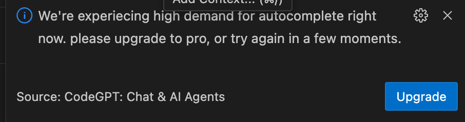

<!-- omit in toc -->
# GitHub Copilot Features

<!-- omit in toc -->
## Table of Contents

- [1. Code Generation and Completion](#1-code-generation-and-completion)
- [2. Code Generation Sample](#2-code-generation-sample)
  - [:page\_with\_curl: example-01.py - Simple Completion](#page_with_curl-example-01py---simple-completion)
  - [:page\_with\_curl: example-02.py - Extra Instructions](#page_with_curl-example-02py---extra-instructions)
  - [:page\_with\_curl: example-03.py - Copilot Auto suggestions](#page_with_curl-example-03py---copilot-auto-suggestions)

---

### 1. Code Generation and Completion

- Lets start with the most basic feature of Copilot: code generation and completion.
- This is a feature that allows you to write code without having to write it yourself.
- Copilot can generate code for you based on the context of your project.
- This is a great feature for beginners who want to learn how to code.
- GitHub Copilot can also complete code for you.
- GitHub Copilot supports a wide range of programming languages, including Python, JavaScript, and Java and much more.

> [!Caution]
> GitHub Copilot is based pon GitHub code and is not perfect, so please be careful when using it.
> Don't assume the code its generated is correct and working perfectly.
> This is why its called `CoPilot`......

### 2. Code Generation Sample

- Lets create a simple Python program that prints "Hello, World!".
- We will tell GitHub Copilot to generate the code for us.
  - Open a new file in your code editor, name it example-01.py.
  - Now lets write this lines in the file:
  - Once you done writing the code use <kbd>ENTER</kbd> or new line to tell GitHub Copilot to generate the code and <kbd> Tab</kbd> to accept the code.
  
  #### :page_with_curl: [example-01.py](./examples/example-01.py) - Simple Completion

  ```python
  ## example-01.py.
  
  # Please write simple Python program that prints "Hello, World!"
  # Copilot output:
  print("Hello, World!")
  ```
- Now lets write the code with a function and a main function.

  #### :page_with_curl: [example-02.py](./examples/example-02.py) - Extra Instructions

  ```python
  ## example-02.py.
  # Please write simple Python program that prints "Hello, World!" and a main function. 

  # Copilot output: 

  def main():
      print("Hello, World!")
  
  if __name__ == "__main__":
      main()
  ```

#### :page_with_curl: [example-03.py](./examples/example-03.py) - Copilot Auto suggestions

- Now lets allow GitHub Copilot to suggest several code options for us
- As before create the file `example-03.py` and write the following lines in the file.
- Onc you done writing the code use <kbd>CTRL</kbd>+ <kbd>ENTER</kbd> and view the suggestions.

> [!Note]
> Since GitHub Copilot is based on the context of your project, it will suggest different code options for you.


> [!Tip]
> Github copilot will suggest several code options for you, so you can choose the one that best fits your needs.
> In some cases the web version is better that the integrated one.

- Sometimes you may not get results from the integrated version of GitHub Copilot, but you can always use the web version of GitHub Copilot to get suggestions.

- If you get a message like this, it means that GitHub Copilot is overloaded and cannot generate code for you.


- Here is a screenshot of the suggestions from the web version of GitHub Copilot:

  