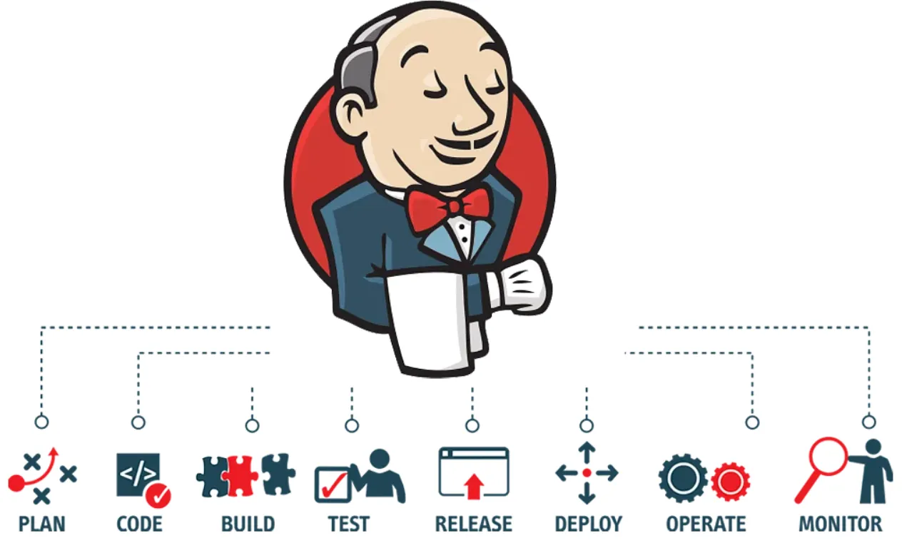

# Jenkins Introduction

Jenkins is a popular open-source automation server used for continuous integration and continuous delivery (CI/CD). It allows DevOps teams to automate building, testing, and deploying applications.

## Guide Overview

This guide (aimed at intermediate DevOps engineers) will cover the following:

- Installation of Jenkins on macOS and Linux using:
  - Homebrew
  - Standard .war file method
- Basic configuration steps and overview of the Jenkins web interface
- Creating a Pipeline job that demonstrates:
  - Running a Docker-based stage
  - Matrix build (parallel execution) of three Python scripts
  - Example Groovy pipeline code and Python scripts

Each section is organized with clear instructions, code examples, and file names as they would appear in a repository. By the end, you will have a working Jenkins installation and a sample pipeline job configured.
